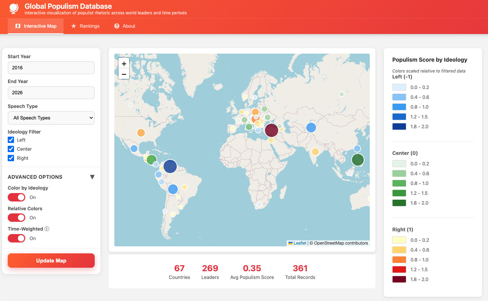

# Global Populism Database

- Etienne P Jacquot (01/31/2026) [etiennej@upenn.edu](mailto:etiennej@upenn.edu)

## Overview

This repository aims to provide tools for researchers interested in the **Global Populism Database v2.1 provided by Harvard Dataverse** (see [DOI 10.7910/DVN/LFTQEZ](https://dataverse.harvard.edu/dataset.xhtml?persistentId=doi:10.7910/DVN/LFTQEZ)).



The database contains information on populist speeches from various countries around the world. Goals include:

- [ ] Using LLMs and embedding models on textual data
- [ ] Using agentic AI workflows (chain of thought, tools, etc) to explore the dataset
- [x] Using an interactive geographic visualization to explore populism trends
- [ ] Providing reproducible code examples for researchers

## Features

### 🗺️ Interactive Geographic Visualization
- **World map** showing populism scores by country
- **Interactive filters** for time periods and speech types
- **Drill-down details** with leader timelines and term-by-term analysis
- **Color-coded visualization** of populism intensity

### 🔌 REST API
- FastAPI backend with comprehensive endpoints
- Filter data by country, leader, year range, and populism scores
- Aggregated statistics and summary data
- Full API documentation with Swagger UI

## Quick Start

### Prerequisites
- Python 3.8 or higher
- pip (Python package manager)

### Installation & Running

1. **Clone this repository** (if you haven't already):
```bash
git clone <your-repo-url>
cd global-populism-db
```

2. **Run the application**:
```bash
./start.sh
```

This script will:
- Create a virtual environment
- Install all dependencies
- Start the FastAPI server

3. **Access the application**:
- **Web Interface**: http://localhost:8000
- **API Documentation**: http://localhost:8000/docs
- **Alternative API Docs**: http://localhost:8000/redoc

### Manual Setup (Alternative)

If you prefer to set up manually:

```bash
# Create virtual environment
python3 -m venv venv

# Activate virtual environment
source venv/bin/activate  # On macOS/Linux
# or
venv\Scripts\activate  # On Windows

# Install dependencies
pip install -r requirements.txt

# Run the server
cd backend
python main.py
```

## Project Structure

```
global-populism-db/
├── backend/
│   └── main.py              # FastAPI application
├── frontend/
│   └── index.html           # Interactive map visualization
├── dataverse_files/
│   ├── GPD_v2.1_20251120_Wide.csv   # Main dataset
│   ├── GPD Codebook_v2.1.pdf        # Dataset documentation
│   └── ...
├── requirements.txt         # Python dependencies
├── start.sh                 # Quick start script
└── README.md
```

## API Endpoints

### Core Endpoints

- `GET /` - API information and available endpoints
- `GET /api/summary` - Dataset summary statistics
- `GET /api/countries` - List all countries
- `GET /api/regions` - List all regions
- `GET /api/leaders` - List leaders (optional country filter)

### Data Endpoints

- `GET /api/data` - Get filtered data
  - Query params: `country`, `leader`, `year_start`, `year_end`, `min_populism`
  
- `GET /api/map-data` - Aggregated data for map visualization
  - Query params: `year_start`, `year_end`, `speech_type`
  
- `GET /api/timeline/{country}` - Timeline of populism scores for a country

## Dataset Information

The Global Populism Database (GPD v2.1) tracks populist rhetoric across:
- **156 countries** worldwide
- **Multiple speech types**: Campaign, Famous, International, Ribbon-cutting
- **Time period**: 1934 - Present
- **Populism scores**: 0-2 scale measuring populist rhetoric intensity

### Key Variables

- `country` - Country name
- `leader` - Leader name
- `party` - Political party
- `lr` - Left-Right ideology (-1=left, 0=center, 1=right)
- `totalaverage` - Overall populism score (0-2)
- `campaign_average` - Campaign speech populism score
- `famous_average` - Famous speech populism score
- `international_average` - International speech populism score
- `ribbon_average` - Ribbon-cutting speech populism score

## Usage Examples

### Exploring the Map

1. **Filter by time period**: Use the year sliders to focus on specific decades
2. **Change speech type**: Select different speech categories to see how populism varies
3. **Click countries**: View detailed leader-by-leader breakdowns
4. **Color intensity**: Darker colors indicate higher populism scores

### Using the API

Example: Get all leaders from Argentina with high populism scores:

```bash
curl "http://localhost:8000/api/data?country=Argentina&min_populism=1.0"
```

Example: Get map data for 2010-2020:

```bash
curl "http://localhost:8000/api/map-data?year_start=2010&year_end=2020"
```

## Future Enhancements

- [ ] LLM-powered speech analysis
- [ ] Embedding-based similarity search
- [ ] Temporal trend analysis with charts
- [ ] Export functionality for filtered datasets
- [ ] Additional visualization types (timelines, comparisons)

## License

Please refer to the original dataset license on Harvard Dataverse. For the code in this repository, see the [LICENSE file](LICENSE.md).